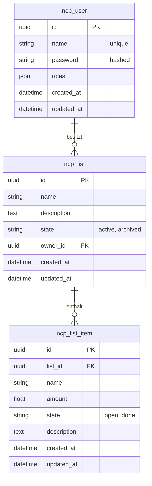

# Datenbank-Dokumentation (ncpList)

Diese Dokumentation beschreibt die physische Datenstruktur, die Tabellenbeziehungen und die Möglichkeiten für den Zugriff auf die Daten.

---

## 📂 Datenbank-Dateien

Die Anwendung nutzt **SQLite** für die lokale Entwicklung und das Testing. Dies ermöglicht eine einfache Handhabung ohne zusätzliche Datenbank-Server.

*   **Entwicklung (Dev):** `var/data.db`
*   **Testing (Test):** `var/test.db`

---

## 🛠️ Zugriff auf die Datenbank

Um die Daten manuell einzusehen oder zu bearbeiten, stehen folgende Möglichkeiten zur Verfügung:

### 1. GUI Tools (Empfohlen)
*   **DB Browser for SQLite:** Ein kostenloses, schlankes Open-Source-Tool. Einfach die `.db` Datei im Tool öffnen.
*   **DBeaver / TablePlus:** Professionelle Datenbank-Clients, die SQLite nativ unterstützen.
*   **VS Code Erweiterung:** "SQLite Viewer" ermöglicht den Blick in die DB direkt aus dem Editor.

### 2. Symfony CLI
Du kannst SQL-Befehle direkt über die Konsole ausführen:
```bash
php bin/console dbal:run-sql "SELECT * FROM ncp_user"
```

### 3. SQLite CLI
Falls `sqlite3` auf deinem System installiert ist:
```bash
sqlite3 var/data.db
```

---

## 📊 Tabellenstruktur & Beziehungen

Die App basiert auf einem klassischen relationalen Modell. Alle IDs werden als **UUIDs** gespeichert, um die Synchronisationsfähigkeit zu gewährleisten.

### ER-Diagramm (Mermaid)



---

## 📝 Tabellendetails

### ncp_user
Speichert die Benutzerinformationen und Authentifizierungsdaten.
*   `id`: Primärschlüssel (UUID).
*   `name`: Der eindeutige Benutzername für den Login.
*   `roles`: JSON-Array (z.B. `["ROLE_USER"]`).

### ncp_list (Einkaufsliste)
Die Kopfdaten einer Liste.
*   `owner_id`: Fremdschlüssel auf den Ersteller der Liste.
*   `state`: Standard ist `active`.

### ncp_list_item (Artikel)
Die einzelnen Positionen innerhalb einer Liste.
*   `list_id`: Referenz auf die zugehörige Liste.
*   `amount`: Menge des Artikels (Float für Einheiten wie 0.5kg).
*   `state`: Standard ist `open`, wird bei Erledigung auf `done` gesetzt.

---

## ⚙️ Naming Strategy
Die Anwendung nutzt die `underscore` Naming Strategy von Doctrine. Das bedeutet:
*   PHP Property `createdAt` -> DB Spalte `created_at`
*   PHP Entity `ShoppingList` -> DB Tabelle `ncp_list` (manuell definiert via `ORM\Table`)
